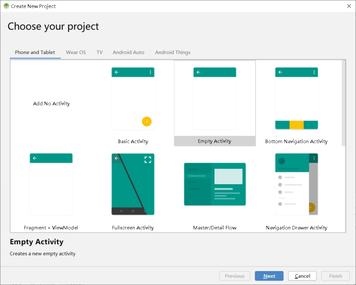
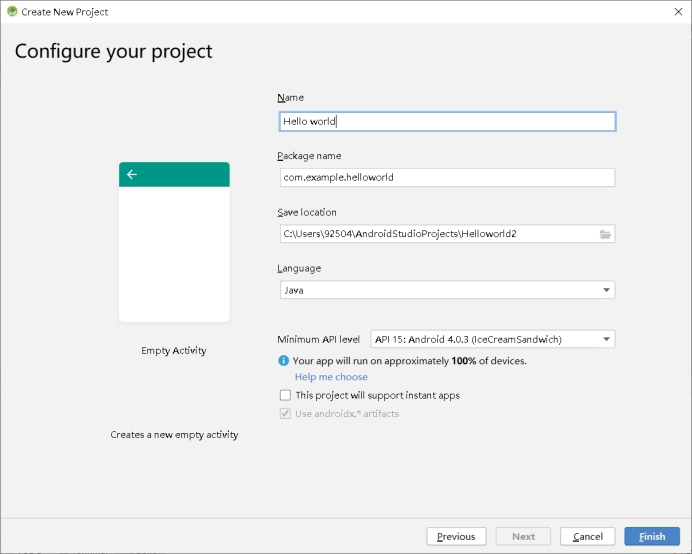
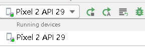
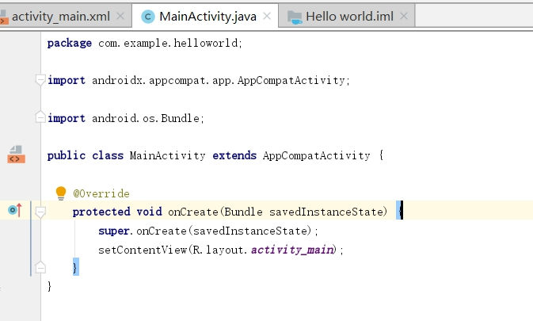
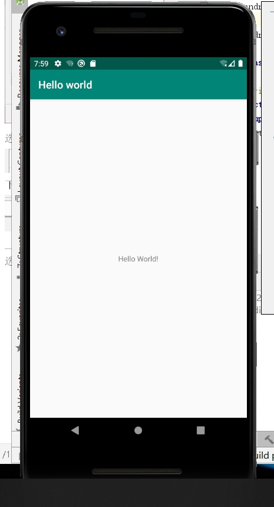
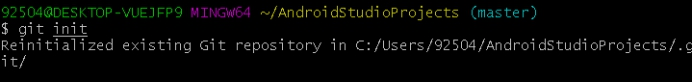
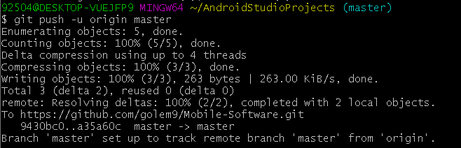

## 实验一：Android开发基础

安装好后

创建新项目Helloword

 

 

创造一个模拟器

选择

 

选择安卓10，下载

 

下载完成

 

选用此设备

直接点击运行默认程序

 

 

成功

 

 

### 同步到github

cd  C:/Users/92504/AndroidStudioProjects

在本地建立github仓库

git init

 

连接仓库

git remote add origin https://github.com/golem9/Mobile-Software.git

添加目录下所有文件

git add.

备注

git commit -m "1"

上传

git push -u origin master

